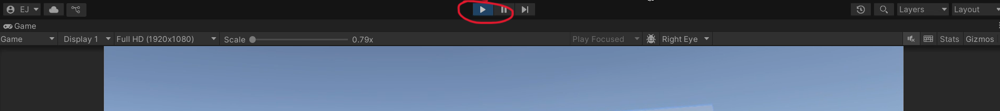
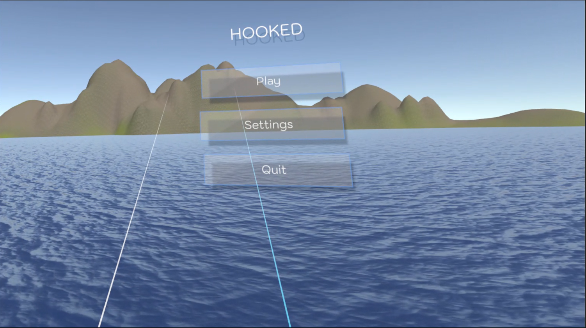
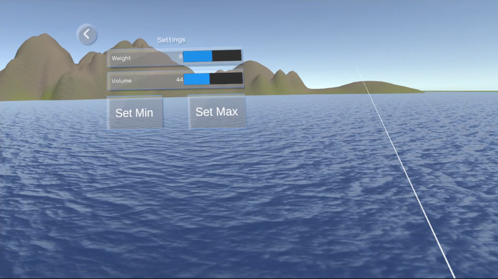
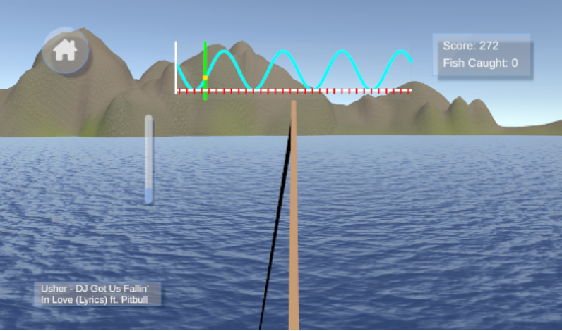
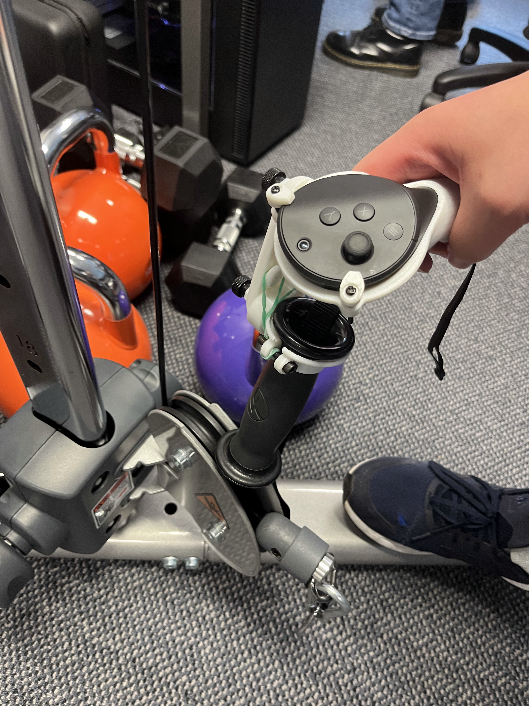
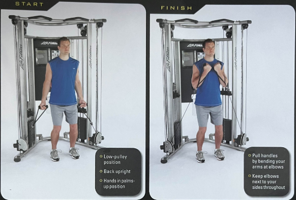

# Rhythm and Immersive Games for Strength Training

The game is a VR fishing game where players perform bicep curls a cable machine with VR controllers connected to it to control the fishing rod. To gain more points and fish, players will need to perform reps in time with background music. Each game will have two sets of 8 reps with a 2 minute rest in between.

## Project Folder Structure
```
├── Assets/                                 # Contains C# scripts, Unity scenes, and other Unity assets
├── Packages/     
│   ├── manifest.json                       # Raw and processed data in Excel format
│   └── packages-lock.json                  # Python scripts for statistical analysis
└── README.md                               # This file
```

## Project Setup

### Prerequisites
#### Hardware
* [Computer specifications](https://www.meta.com/en-gb/help/quest/140991407990979/#specs.)
* Meta quest pro 3
* Oculus V79.1034

#### Software
* Unity Version 2022.3.62f1
* Meta Quest Link

### Running the Game
* Import the project in Unity Hub
* Open the project in Unity
* Go to the `Home` scene in `Assets/Scenes/Home.unity`
* Click the play button near the middle top of the window to run the game.

* You will begin in the `Home` scene

* Before playing the game, go to settings to calibrate your movement range and set the weight of the cable machine you are using.

* Once you have calibrated your movement range and set the weight, go back to the `Home` scene.
* Click the `Play` button to begin playing the game


### Cable Machine Setup
* Before pressing play, you will need to set up the cable machine and VR controls
* The VR controllers should be attached to the cable machine handles using 3D printed handles with the controllers in them.


* The bicep curls are to be performed in a similar manner to the image shown below.


## Playing the Game
* When the game starts, you will be in the home scene
* Before playing the game, you will need to calibrate the lowest and highest points of your movement.
* Go into Settings to calibrate.
* Select `Set min` to set the lowest point of your movement.
* Select `Set max` to set the highest point of your movement.
* Go back to the home scene, and select `Play` to start the game.

## Third-party Assets:
- [URP Stylized Water Shader - Proto Series](https://assetstore.unity.com/packages/vfx/shaders/urp-stylized-water-shader-proto-series-187485) - Extension Asset License
- [LowPoly Animated Fish (Quaternius)](https://quaternius.itch.io/lowpoly-animated-fish) - CC0 License

## Contributors

| Name                | UPI     | Github Username                                             |
| :------------------ | :------ | :---------------------------------------------------------- |
| Amanda Lowe         | alow719 | [starfluffy](https://github.com/starfluffy)                 |
| Charles Leng        | clen678 | [clen678](https://github.com/clen678)                       |
| Eason Jin           | ejin458 | [Eason-Jin](https://github.com/Eason-Jin)                   |
| Marwah Al-Akam      | mala962 | [MarwahAlakam](https://github.com/MarwahAlakam)             |
| Steven Yao          | jyao347 | [steven11-cmd](https://github.com/steven11-cmd)             |
